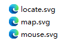
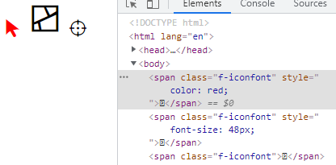

# Svg转字体文件

## 说明

安装转换工具`@fssgis/svg2icon`

```bash
npm i -g @fssgis/svg2icon
```

执行命令`svg2icon`

```bash
svg2icon [svgDir] [output] [metadata]
# example
svg2icon ./svg ./ttf/iconfont2.ttf ./metadata.json
```

- [svgDir]：存放svg文件的目录路径
- [output]：输出ttf字体文件路径
- [metadata]：元数据文件路径

## 使用案例

svg文件



```json
# metadata.json
{
  "mouse": "\uE001",
  "map": "\uE002",
  "locate": "\uE003"
}
```

```css
@font-face {
  font-family: fssgicon;
  src: url(./ttf/iconfont.ttf); /* svg2icon 生成的字体文件 */
}
.f-iconfont {
  font-family: fssgicon;
}
```

```html
<span class="f-iconfont">&#xE001;</span>
<span class="f-iconfont">&#xE002;</span>
<span class="f-iconfont">&#xE003;</span>
```

